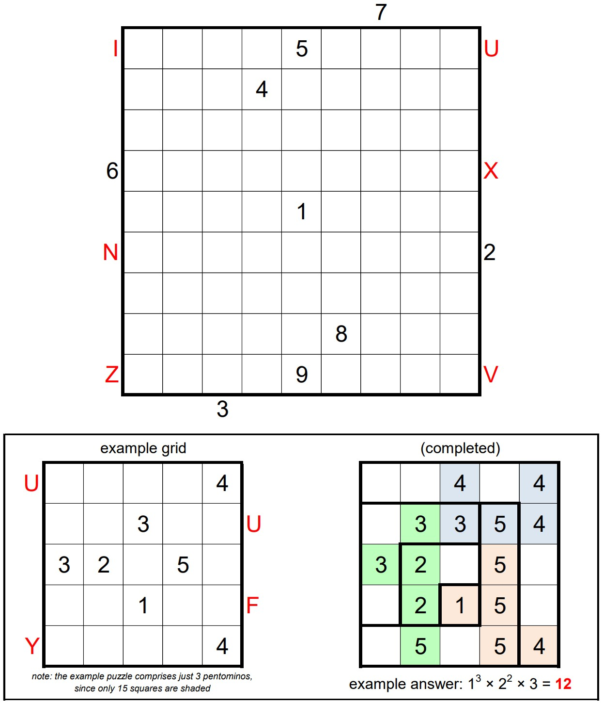

# Jane Street Sep 2025 Puzzle - Hooks 11

## Problem

The grid above can be partitioned into 9 L-shaped “hooks”. The largest is
9-by-9 (contains 17 squares), the next largest is 8-by-8 (contains 15 squares),
and so on. The smallest hook is just a single square. Find where the hooks are
located, and place nine 9’s in one of the hooks, eight 8’s in another, seven
7’s in another, and so on.

The filled squares must form a connected region. (Squares are “connected” if
they are orthogonally adjacent.) Furthermore, every 2-by-2 region must contain
at least one unfilled square.

The set of filled squares must be decomposable into 9 distinct pentominos, with
no repeated shapes (including reflection or rotation). Finally, the sum of the
of the values in each pentomino must be a multiple of 5.

A value outside the grid denotes the either first number or pentomino1 (from
the decomposition) seen when looking into that row or column.

The answer to this puzzle is the product of the areas of the connected groups
of empty squares in the completed grid.

*   Using the canonical pentomino naming scheme – F, I, L, N, P, T, U, V, W, X,
Y, Z.

[Link to problem](https://www.janestreet.com/puzzles/hooks-11-index/)

## Solution

## Approach

- `pent_util.cpp`: Genrates all rotated and reflected combinations of each
pentomino.
- `pent_solver.cpp`: Generates all possible pentomino placements in 9x9 grid
based on the problem constraints.
- `hook_solver.cpp`: Generates all possible hook placements in 9x9 grid based on
the given problem constraints.
- `hook_pent_solver.cpp`: Uses the results generated by `pent_solver.cpp` and
`hook_solver.cpp` to do a matching which gives the final result.
